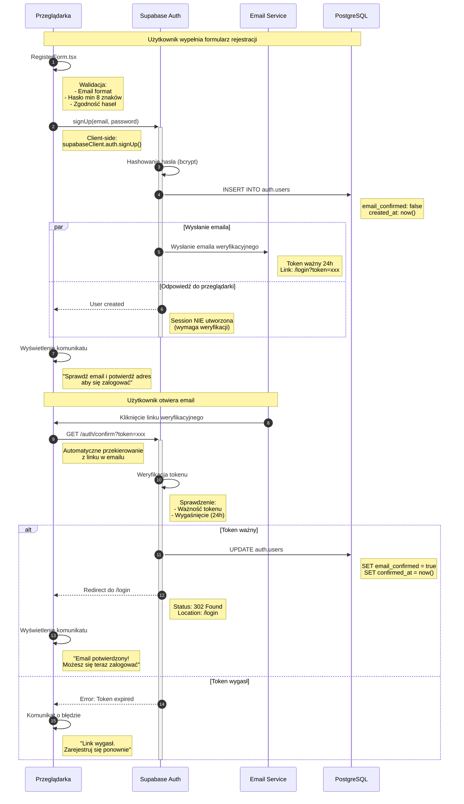
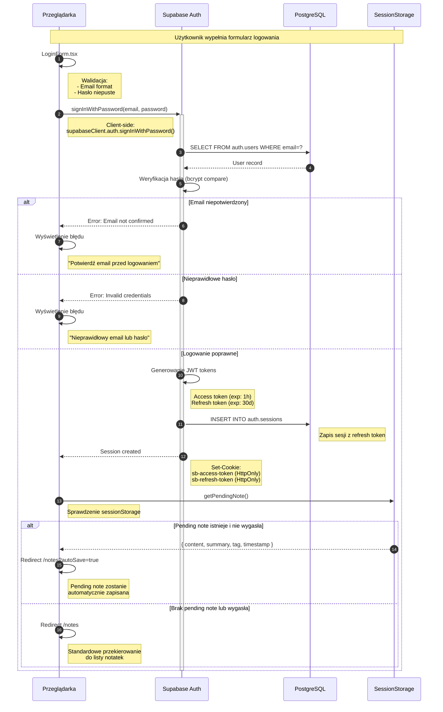
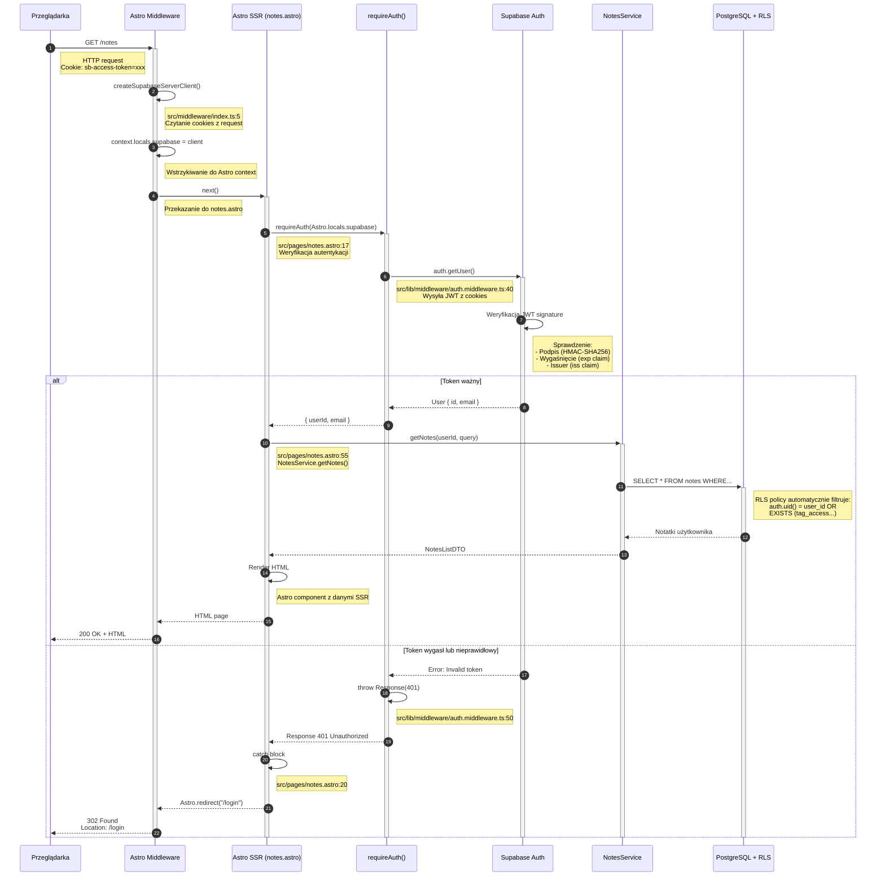
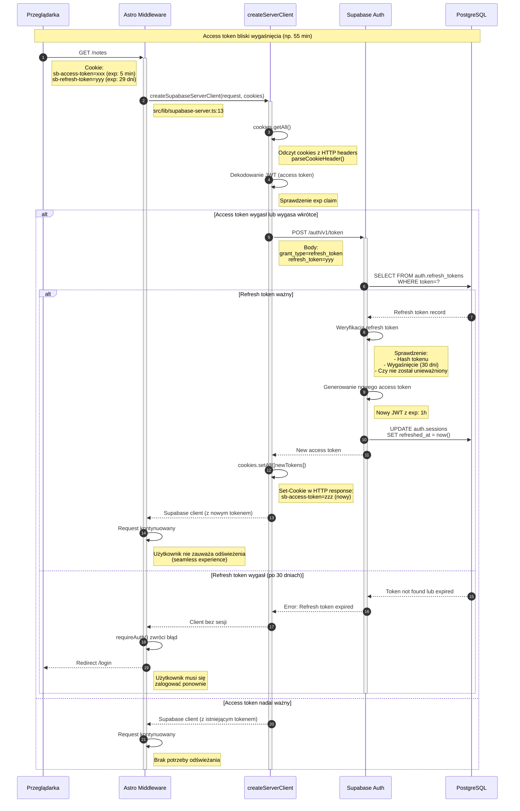
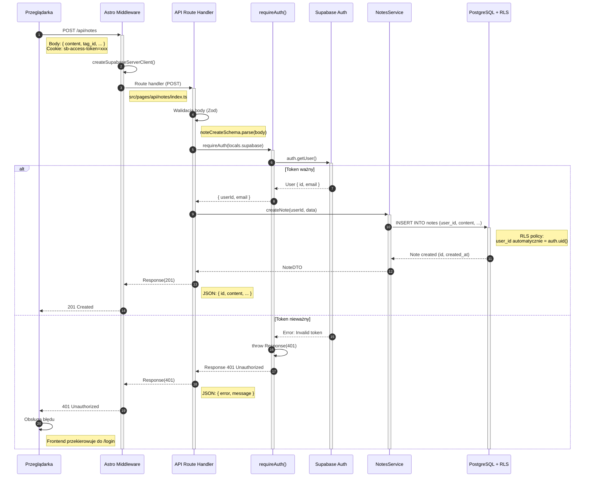
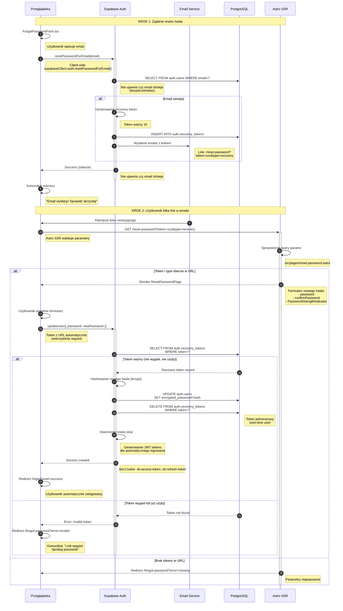
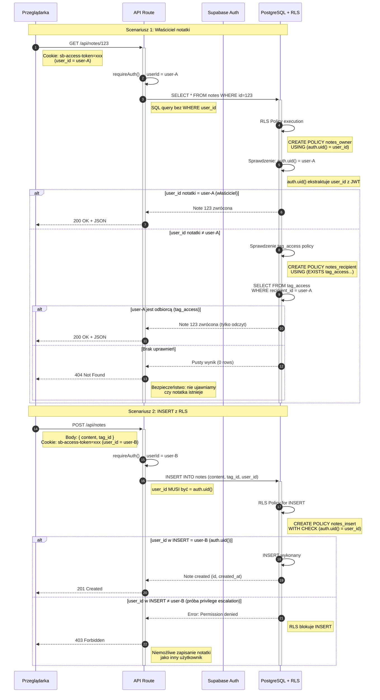
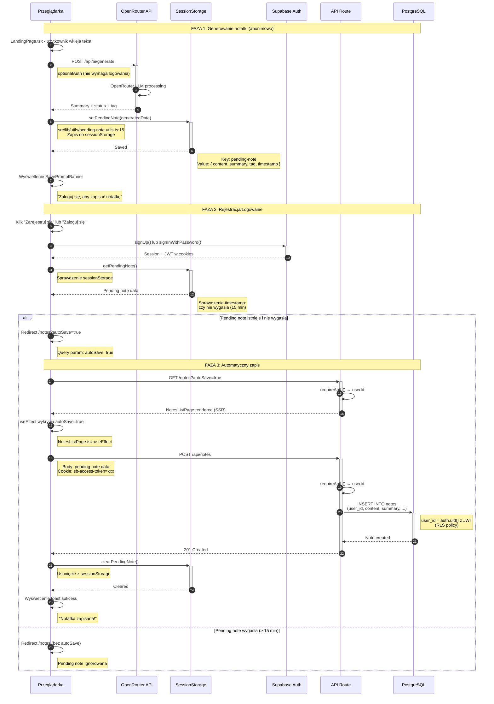

# Diagram architektury autentykacji - 10xNotes

Ten dokument przedstawia pełną architekturę autentykacji w aplikacji 10xNotes, podzieloną na osobne diagramy dla każdego przepływu.

## Spis treści

1. [Rejestracja i weryfikacja email](#1-rejestracja-i-weryfikacja-email)
2. [Logowanie z pending note flow](#2-logowanie-z-pending-note-flow)
3. [Dostęp do chronionej strony (SSR)](#3-dostęp-do-chronionej-strony-ssr)
4. [Automatyczne odświeżanie tokenów](#4-automatyczne-odświeżanie-tokenów)
5. [API endpoint z requireAuth](#5-api-endpoint-z-requireauth)
6. [Odzyskiwanie hasła](#6-odzyskiwanie-hasła)
7. [Wylogowanie](#7-wylogowanie)
8. [Row Level Security (RLS)](#8-row-level-security-rls)
9. [Pending Note Auto-Save](#9-pending-note-auto-save)

---

## 1. Rejestracja i weryfikacja email

Przepływ tworzenia nowego konta z potwierdzeniem adresu email.



**Kluczowe elementy:**

- `RegisterForm.tsx:87` - wywołanie `supabaseClient.auth.signUp()`
- Email confirmation wymagany przed logowaniem
- Token weryfikacyjny ważny 24h (konfigurowalny w Supabase Dashboard)
- Hasło hashowane bcrypt przed zapisem
- Session NIE tworzona automatycznie (wymaga weryfikacji)

---

## 2. Logowanie z pending note flow

Autentykacja użytkownika z obsługą wygenerowanej notatki przed rejestracją.



**Kluczowe elementy:**

- `LoginForm.tsx:77` - wywołanie `signInWithPassword()`
- `pending-note.utils.ts:40` - `getPendingNote()` sprawdza sessionStorage
- JWT tokens w HttpOnly cookies (ochrona XSS)
- SameSite=Lax (ochrona CSRF)
- Pending note expiry: 15 minut

---

## 3. Dostęp do chronionej strony (SSR)

Przepływ server-side rendering dla stron wymagających autentykacji.



**Kluczowe elementy:**

- `src/middleware/index.ts:5` - wstrzykiwanie Supabase client
- `src/lib/middleware/auth.middleware.ts:40` - `requireAuth()`
- `src/pages/notes.astro:17` - weryfikacja przed renderowaniem
- RLS automatycznie filtruje dane po `auth.uid()`
- Server-side rendering z uwierzytelnionymi danymi

---

## 4. Automatyczne odświeżanie tokenów

Mechanizm bezproblemowego przedłużania sesji bez ponownego logowania.



**Kluczowe elementy:**

- `@supabase/ssr` automatycznie wykrywa wygasające tokeny
- Refresh token używany TYLKO do generowania nowego access token
- Access token: 1h (krótkotrwały, używany do każdego requestu)
- Refresh token: 30 dni (długotrwały, przechowywany bezpiecznie w cookies)
- Proces transparentny dla użytkownika

---

## 5. API endpoint z requireAuth

Autentykacja dla API endpoints (REST).



**Kluczowe elementy:**

- `src/pages/api/notes/index.ts:30` - wywołanie `requireAuth()`
- Walidacja input z Zod przed przetwarzaniem
- RLS automatycznie ustawia `user_id = auth.uid()`
- Response 401 przechwytywany przez frontend
- Spójny error handling (AuthError interface)

---

## 6. Odzyskiwanie hasła

Przepływ resetowania hasła dla zapomnianych credentials.



**Kluczowe elementy:**

- `ForgotPasswordForm.tsx` - żądanie resetu (DO IMPLEMENTACJI)
- `ResetPasswordForm.tsx` - ustawienie nowego hasła (DO IMPLEMENTACJI)
- Recovery token ważny 1h (konfigurowalny)
- One-time use (token usuwany po użyciu)
- Automatyczne logowanie po resecie
- Brak ujawniania czy email istnieje (bezpieczeństwo)

---

## 7. Wylogowanie

Zakończenie sesji i czyszczenie tokenów.

```mermaid
sequenceDiagram
    autonumber

    participant Browser as Przeglądarka
    participant Supabase as Supabase Auth
    participant DB as PostgreSQL

    Note over Browser,DB: Użytkownik klika "Wyloguj się"

    Browser->>Browser: Navbar.tsx - handleSignOut()
    Note right of Browser: Komponent nawigacji

    Browser->>+Supabase: signOut()
    Note right of Browser: Client-side:<br/>supabaseClient.auth.signOut()

    Supabase->>DB: DELETE FROM auth.sessions<br/>WHERE refresh_token=?
    Note right of DB: Usunięcie sesji z bazy

    Supabase->>DB: DELETE FROM auth.refresh_tokens<br/>WHERE token=?
    Note right of DB: Unieważnienie refresh token

    Supabase-->>Browser: Success
    Note right of Supabase: Set-Cookie (empty):<br/>sb-access-token=; Max-Age=0<br/>sb-refresh-token=; Max-Age=0

    deactivate Supabase

    Browser->>Browser: Czyszczenie lokalnego stanu
    Note right of Browser: React state reset:<br/>- user = null<br/>- session = null

    Browser->>Browser: Redirect do /
    Note right of Browser: Strona główna (anonimowa)

    Note over Browser,DB: Sesja zakończona - brak dostępu do chronionych zasobów
```

**Kluczowe elementy:**

- `Navbar.tsx` - button onClick wywołuje `signOut()`
- Cookies czyszczone przez `Set-Cookie: Max-Age=0`
- Sesja usuwana z bazy danych
- Refresh token unieważniany
- Redirect do strony głównej

---

## 8. Row Level Security (RLS)

Kontrola dostępu na poziomie bazy danych.



**Kluczowe elementy:**

- RLS policies w `supabase/migrations/20251029000002_complete_rls_rebuild.sql`
- `auth.uid()` automatycznie ekstraktuje user_id z JWT
- Filtrowanie na poziomie bazy (nie da się ominąć)
- Owner policy: pełen dostęp (SELECT, UPDATE, DELETE)
- Recipient policy: tylko odczyt (SELECT through tag_access)
- Ochrona przed privilege escalation

---

## 9. Pending Note Auto-Save

Unikalny feature 10xNotes - seamless onboarding experience.



**Kluczowe elementy:**

- `src/lib/utils/pending-note.utils.ts` - funkcje do zarządzania pending note
- `sessionStorage` przechowuje dane lokalnie (nie wysyłane do serwera)
- Expiry 15 minut zapobiega stale data
- `autoSave=true` query param uruchamia automatyczny zapis
- Seamless UX - użytkownik nie traci wygenerowanej notatki
- Backend wymaga valid JWT (RLS protection)

---

## Architektura autentykacji - Podsumowanie

### Stack technologiczny

```
┌─────────────────────────────────────────────────────┐
│ FRONTEND (Browser)                                  │
├─────────────────────────────────────────────────────┤
│ • React 19 (Interactive components)                 │
│ • Astro 5 (SSR + Static pages)                      │
│ • @supabase/ssr (Browser client)                    │
│ • SessionStorage (Pending note)                     │
└────────────────┬────────────────────────────────────┘
                 │ HTTP + Cookies (JWT tokens)
                 ▼
┌─────────────────────────────────────────────────────┐
│ MIDDLEWARE (Astro)                                  │
├─────────────────────────────────────────────────────┤
│ • createSupabaseServerClient()                      │
│ • Cookie management (getAll, setAll)                │
│ • Context injection (locals.supabase)               │
└────────────────┬────────────────────────────────────┘
                 │
                 ▼
┌─────────────────────────────────────────────────────┐
│ BACKEND (Astro SSR + API)                           │
├─────────────────────────────────────────────────────┤
│ • requireAuth() / optionalAuth()                    │
│ • Service layer (NotesService, TagsService, etc.)   │
│ • Zod validation                                    │
└────────────────┬────────────────────────────────────┘
                 │ JWT verification
                 ▼
┌─────────────────────────────────────────────────────┐
│ AUTHENTICATION (Supabase Auth)                      │
├─────────────────────────────────────────────────────┤
│ • JWT tokens (access 1h, refresh 30d)               │
│ • Email verification                                │
│ • Password hashing (bcrypt)                         │
│ • Session management                                │
└────────────────┬────────────────────────────────────┘
                 │ auth.uid()
                 ▼
┌─────────────────────────────────────────────────────┐
│ DATABASE (PostgreSQL + RLS)                         │
├─────────────────────────────────────────────────────┤
│ • Row Level Security policies                       │
│ • auth.uid() extraction from JWT                    │
│ • Automatic filtering (owner/recipient)             │
└─────────────────────────────────────────────────────┘
```

### Kluczowe aspekty bezpieczeństwa

#### 1. JWT Tokens

- **Access Token**: Krótkotrwały (1h), używany do każdego requestu
- **Refresh Token**: Długotrwały (30 dni), służy tylko do odnowienia
- **HttpOnly Cookies**: JavaScript nie ma dostępu (ochrona XSS)
- **SameSite=Lax**: Ochrona przed CSRF
- **Secure flag**: W produkcji tylko przez HTTPS

#### 2. Row Level Security (RLS)

```sql
-- Przykładowa policy (owner)
CREATE POLICY "notes_owner_policy" ON notes
  FOR ALL USING (auth.uid() = user_id);

-- Policy dla odbiorców (tag_access)
CREATE POLICY "notes_recipient_policy" ON notes
  FOR SELECT USING (
    EXISTS (
      SELECT 1 FROM tag_access
      WHERE tag_id = notes.tag_id
        AND recipient_id = auth.uid()
    )
  );
```

**Zalety:**

- Kontrola dostępu na poziomie bazy danych
- Niemożliwe ominięcie (nawet przez SQL injection)
- `auth.uid()` automatycznie ekstraktuje user_id z JWT
- Ochrona przed privilege escalation

#### 3. Email Verification

- Token weryfikacyjny ważny 24h
- One-time use (token staje się nieważny po użyciu)
- Wymagane przed logowaniem
- Zapobiega spam accounts

#### 4. Password Reset

- Recovery token ważny 1h (short-lived)
- One-time use (token usuwany po użyciu)
- Brak ujawniania czy email istnieje (bezpieczeństwo)
- Automatyczne logowanie po resecie

#### 5. Middleware Protection

- Server-side validation (`requireAuth`)
- Automatyczne redirect niezalogowanych użytkowników
- Token refresh przed wygaśnięciem
- Context injection dla spójnego API

### Cykl życia sesji

```
┌────────────────┐
│ 1. LOGIN       │ → JWT tokens w HttpOnly cookies
│                │   (access: 1h, refresh: 30d)
└────────┬───────┘
         │
         ▼
┌────────────────┐
│ 2. REQUEST     │ → Middleware wstrzykuje Supabase client
│                │   z cookies
└────────┬───────┘
         │
         ▼
┌────────────────┐
│ 3. VALIDATION  │ → requireAuth sprawdza access token
│                │   (getUser)
└────────┬───────┘
         │
         ▼
┌────────────────┐
│ 4. AUTO-REFRESH│ → Przed wygaśnięciem: użyj refresh token
│                │   (seamless, transparent)
└────────┬───────┘
         │
         ▼
┌────────────────┐
│ 5. EXPIRY      │ → Po 30 dniach: wymagane ponowne logowanie
│                │   (refresh token wygasł)
└────────┬───────┘
         │
         ▼
┌────────────────┐
│ 6. LOGOUT      │ → Cookies czyszczone, sesja zakończona
└────────────────┘
```

### Implementacja w kodzie

| Komponent          | Lokalizacja                             | Odpowiedzialność                   |
| ------------------ | --------------------------------------- | ---------------------------------- |
| **Client-side**    |
| Supabase client    | `src/db/supabase.client.ts`             | Browser client dla auth operations |
| Login form         | `src/components/LoginForm.tsx:77`       | signInWithPassword()               |
| Register form      | `src/components/RegisterForm.tsx:87`    | signUp()                           |
| Navbar logout      | `src/components/layout/Navbar.tsx`      | signOut()                          |
| Pending note utils | `src/lib/utils/pending-note.utils.ts`   | sessionStorage management          |
| **Server-side**    |
| Middleware         | `src/middleware/index.ts:5`             | Supabase client injection          |
| Server client      | `src/lib/supabase-server.ts:13`         | Cookie-based client                |
| Auth middleware    | `src/lib/middleware/auth.middleware.ts` | requireAuth(), optionalAuth()      |
| Protected pages    | `src/pages/notes.astro:17`              | requireAuth call                   |
| API routes         | `src/pages/api/**/*.ts`                 | requireAuth in handlers            |
| **Database**       |
| RLS policies       | `supabase/migrations/*.sql`             | Row Level Security                 |
| Auth schema        | Supabase managed                        | auth.users, auth.sessions          |

---

## Pending Note Flow - Szczegółowy opis

Unikalny feature 10xNotes zapewniający seamless onboarding:

### Problem

Użytkownik generuje notatkę (test drive), ale nie ma konta. Jak zachować wygenerowane dane bez wymogu logowania?

### Rozwiązanie

1. **Generowanie** (anonimowo) → zapis do `sessionStorage`
2. **Zachęta** → `SavePromptBanner` z linkami do rejestracji/logowania
3. **Autentykacja** → użytkownik zakłada konto lub loguje się
4. **Auto-redirect** → `/notes?autoSave=true`
5. **Auto-save** → `NotesListPage` automatycznie wysyła POST /api/notes
6. **Cleanup** → pending note usuwana z `sessionStorage`

### Bezpieczeństwo

- Dane tylko lokalnie (nie wysyłane do serwera bez autentykacji)
- Expiry 15 minut (zapobiega stale data)
- Backend wymaga valid JWT (RLS protection)
- User nie może zapisać notatki jako inny użytkownik (RLS blokuje)

### Kod

```typescript
// Zapis pending note
setPendingNote({
  content: string,
  summary: string,
  goalStatus: string,
  tag: string,
  timestamp: Date.now(),
});

// Odczyt po logowaniu
const pending = getPendingNote();
if (pending && !isExpired(pending.timestamp, 15)) {
  redirect("/notes?autoSave=true");
}

// Auto-save w NotesListPage
useEffect(() => {
  if (searchParams.get("autoSave") === "true" && pendingNote) {
    await createNote(pendingNote);
    clearPendingNote();
  }
}, []);
```

---

## Podsumowanie końcowe

Aplikacja 10xNotes implementuje nowoczesną, bezpieczną autentykację opartą na:

✅ **JWT tokens** w HttpOnly cookies (ochrona XSS)
✅ **Supabase Auth** jako backend autentykacji
✅ **Row Level Security** dla kontroli dostępu na poziomie bazy
✅ **Automatyczne odświeżanie tokenów** dla seamless UX
✅ **Email verification** dla bezpieczeństwa
✅ **Password reset** z short-lived tokens
✅ **Pending note flow** dla lepszego onboardingu

Wszystkie przepływy są zabezpieczone przed typowymi atakami (XSS, CSRF, privilege escalation, SQL injection) i zgodne z best practices dla JWT-based authentication.

### Status implementacji

| Feature             | Status              | Lokalizacja                                  |
| ------------------- | ------------------- | -------------------------------------------- |
| Rejestracja         | ✅ Zaimplementowane | `RegisterForm.tsx`, `register.astro`         |
| Weryfikacja email   | ✅ Zaimplementowane | Supabase Auth                                |
| Logowanie           | ✅ Zaimplementowane | `LoginForm.tsx`, `login.astro`               |
| Pending note flow   | ✅ Zaimplementowane | `pending-note.utils.ts`, `NotesListPage.tsx` |
| Protected pages     | ✅ Zaimplementowane | `notes.astro`, `settings.astro`              |
| API auth            | ✅ Zaimplementowane | `requireAuth()` w route handlers             |
| Token refresh       | ✅ Zaimplementowane | `@supabase/ssr` automatic                    |
| Wylogowanie         | ✅ Zaimplementowane | `Navbar.tsx`                                 |
| RLS policies        | ✅ Zaimplementowane | `supabase/migrations/*.sql`                  |
| **Forgot password** | ❌ Do implementacji | Spec: `auth-spec.md`                         |
| **Reset password**  | ❌ Do implementacji | Spec: `auth-spec.md`                         |

### Kolejne kroki (Forgot Password - zgodnie z auth-spec.md)

Aby ukończyć moduł autentykacji zgodnie z US-001 z PRD:

1. Utworzyć `src/pages/forgot-password.astro`
2. Utworzyć `src/components/ForgotPasswordPage.tsx`
3. Utworzyć `src/components/ForgotPasswordForm.tsx`
4. Utworzyć `src/pages/reset-password.astro` (z walidacją tokenu)
5. Utworzyć `src/components/ResetPasswordPage.tsx`
6. Utworzyć `src/components/ResetPasswordForm.tsx`
7. Dodać link "Nie pamiętasz hasła?" w `LoginPage.tsx`
8. Skonfigurować Reset Password Email template w Supabase Dashboard

Szacowany czas: **4-6 godzin** (Faza 1 z auth-spec.md)
