# Diagram podróży użytkownika - Moduł autentykacji 10xNotes

Ten diagram przedstawia pełną podróż użytkownika w module autentykacji aplikacji 10xNotes, obejmując:

- Onboarding nowego użytkownika (test drive → rejestracja → weryfikacja)
- Logowanie i odzyskiwanie hasła
- Praca z aplikacją (właściciel vs odbiorca)
- Dostęp publiczny (anonimowy)
- Usunięcie konta

## Diagram przepływu

```mermaid
stateDiagram-v2
    [*] --> StronaGlowna

    state "Strona Główna" as StronaGlowna {
        [*] --> WitamyNowego
        WitamyNowego: Użytkownik wchodzi na stronę (anonimowo)
        note right of WitamyNowego
            Dostępne akcje:
            - Wklejenie notatki
            - Generowanie podsumowania
            - Rejestracja/Logowanie
        end note
    }

    StronaGlowna --> GenerowanieNotatki: Użytkownik wkleja tekst
    StronaGlowna --> PanelLogowania: Klik "Zaloguj się"
    StronaGlowna --> PanelRejestracji: Klik "Zarejestruj się"

    state "Test Drive - Generowanie" as GenerowanieNotatki {
        [*] --> WklejanieNotatki
        WklejanieNotatki: Wklejenie treści do 5000 znaków
        WklejanieNotatki --> WalidacjaDlugosci

        state if_dlugosc <<choice>>
        WalidacjaDlugosci --> if_dlugosc
        if_dlugosc --> GenerowaniePodsumowania: Długość OK
        if_dlugosc --> BladDlugosci: Przekroczono limit

        BladDlugosci: Komunikat o błędzie
        BladDlugosci --> WklejanieNotatki

        GenerowaniePodsumowania: Wywołanie API OpenRouter
        note right of GenerowaniePodsumowania
            Loader widoczny 3-10s
            Generowanie w języku notatki
            Timeout: 60s
        end note

        GenerowaniePodsumowania --> WynikPodsumowania
        WynikPodsumowania: Wyświetlenie wyniku
        note right of WynikPodsumowania
            Zawiera:
            - Streszczenie (50-200 słów)
            - Status celów
            - Propozycja etykiety
        end note

        WynikPodsumowania --> ZachętatDoZapisu
        ZachętatDoZapisu: Banner "Zaloguj się, aby zapisać"
    }

    GenerowanieNotatki --> DecyzjaZapis: Użytkownik chce zapisać?

    state if_zapis <<choice>>
    DecyzjaZapis --> if_zapis
    if_zapis --> PanelRejestracji: TAK - Klik rejestracja
    if_zapis --> PanelLogowania: TAK - Klik logowanie
    if_zapis --> StronaGlowna: NIE - Pozostanie

    state "Autentykacja" as Autentykacja {
        state "Rejestracja" as PanelRejestracji {
            [*] --> FormularzRejestracji
            FormularzRejestracji: Wypełnienie danych
            note right of FormularzRejestracji
                Pola:
                - Email
                - Hasło (min 8 znaków)
                - Potwierdzenie hasła
                - Wskaźnik siły hasła
            end note

            FormularzRejestracji --> WalidacjaRejestracji

            state if_walidacja_rej <<choice>>
            WalidacjaRejestracji --> if_walidacja_rej
            if_walidacja_rej --> WyslanieEmailaWeryfikacyjnego: Dane poprawne
            if_walidacja_rej --> FormularzRejestracji: Błędy walidacji

            WyslanieEmailaWeryfikacyjnego: Supabase wysyła email
            WyslanieEmailaWeryfikacyjnego --> CzekanieNaWeryfikację

            CzekanieNaWeryfikację: Komunikat o wysłaniu emaila
            note right of CzekanieNaWeryfikację
                "Sprawdź swoją skrzynkę email
                i potwierdź adres, aby się zalogować"
            end note
        }

        state "Logowanie" as PanelLogowania {
            [*] --> FormularzLogowania
            FormularzLogowania: Wprowadzanie danych logowania
            note right of FormularzLogowania
                Pola:
                - Email
                - Hasło
                - "Pokaż hasło"
                Link: "Nie pamiętasz hasła?"
            end note

            FormularzLogowania --> WalidacjaLogowania
            FormularzLogowania --> OdzyskiwanieHasla: Klik link odzyskiwania

            state if_walidacja_log <<choice>>
            WalidacjaLogowania --> if_walidacja_log
            if_walidacja_log --> SprawdzenieEmailPotwierdzony: Dane poprawne
            if_walidacja_log --> FormularzLogowania: Błędne dane

            state if_email_confirmed <<choice>>
            SprawdzenieEmailPotwierdzony --> if_email_confirmed
            if_email_confirmed --> SprawdzeniePendingNote: Email potwierdzony
            if_email_confirmed --> KomunikatWeryfikacji: Brak potwierdzenia

            KomunikatWeryfikacji: Prośba o weryfikację emaila
            KomunikatWeryfikacji --> FormularzLogowania
        }

        state "Odzyskiwanie Hasła" as OdzyskiwanieHasla {
            [*] --> FormularzForgotPassword
            FormularzForgotPassword: Podanie adresu email
            note right of FormularzForgotPassword
                Pola:
                - Email
                Przycisk: "Wyślij link resetujący"
            end note

            FormularzForgotPassword --> WyslanieEmailaResetujacego

            WyslanieEmailaResetujacego: Supabase wysyła email z tokenem
            note right of WyslanieEmailaResetujacego
                Token ważny 1 godzinę
                Link: /reset-password?token=xxx
            end note

            WyslanieEmailaResetujacego --> KomunikatEmailWyslany
            KomunikatEmailWyslany: "Email wysłany! Sprawdź skrzynkę"

            KomunikatEmailWyslany --> OczekiwanieNaKlikLink
            OczekiwanieNaKlikLink --> KlikLinkuResetujacego

            KlikLinkuResetujacego: Użytkownik klika link w emailu
            KlikLinkuResetujacego --> WalidacjaTokenu

            state if_token <<choice>>
            WalidacjaTokenu --> if_token
            if_token --> FormularzResetPassword: Token poprawny
            if_token --> BladTokenu: Token niepoprawny/wygasły

            BladTokenu: Redirect do /forgot-password
            note right of BladTokenu
                Parametr: ?error=invalid_token
                Komunikat: "Link wygasł lub jest nieprawidłowy"
            end note
            BladTokenu --> FormularzForgotPassword

            FormularzResetPassword: Ustawienie nowego hasła
            note right of FormularzResetPassword
                Pola:
                - Nowe hasło (min 8 znaków)
                - Potwierdzenie hasła
                - Wskaźnik siły hasła
            end note

            FormularzResetPassword --> AktualizacjaHasla
            AktualizacjaHasla: Supabase zapisuje nowe hasło
            AktualizacjaHasla --> KomunikatHasloZmienione

            KomunikatHasloZmienione: "Hasło zmienione pomyślnie!"
            note right of KomunikatHasloZmienione
                Przycisk: "Przejdź do logowania"
                Redirect: /login?reset=success
            end note
        }
    }

    CzekanieNaWeryfikację --> KlikLinkuWeryfikacyjnego
    KlikLinkuWeryfikacyjnego: Użytkownik klika link w emailu
    KlikLinkuWeryfikacyjnego --> EmailPotwierdzony
    EmailPotwierdzony: Supabase potwierdza email
    EmailPotwierdzony --> PanelLogowania

    KomunikatHasloZmienione --> PanelLogowania

    state if_pending_note <<choice>>
    SprawdzeniePendingNote --> if_pending_note
    if_pending_note --> AutoZapisPendingNote: Pending note istnieje
    if_pending_note --> PanelNotatek: Brak pending note

    AutoZapisPendingNote: Automatyczny zapis notatki z sessionStorage
    note right of AutoZapisPendingNote
        Redirect: /notes?autoSave=true
        SessionStorage: usunięcie pending note
    end note
    AutoZapisPendingNote --> PanelNotatek

    state "Aplikacja - Użytkownik zalogowany" as AplikacjaZalogowany {
        state "Panel Notatek" as PanelNotatek {
            [*] --> ListaNotatek
            ListaNotatek: Wyświetlenie listy notatek
            note right of ListaNotatek
                - Sidebar z etykietami
                - Filtrowanie po etykiecie
                - Sortowanie (data, status)
                - Wyszukiwanie
            end note

            ListaNotatek --> WyborAkcji

            state if_akcja <<choice>>
            WyborAkcji --> if_akcja
            if_akcja --> SzczegolyNotatki: Przeglądanie
            if_akcja --> GenerowanieNotatki: Nowa notatka
            if_akcja --> Ustawienia: Ustawienia konta
            if_akcja --> Wylogowanie: Wyloguj
        }

        state "Szczegóły i Edycja" as SzczegolyNotatki {
            [*] --> WidokSzczegolowy
            WidokSzczegolowy: Pełny widok notatki
            note right of WidokSzczegolowy
                - Oryginał treści
                - Podsumowanie
                - Status celów
                - Etykieta
                - Data spotkania
            end note

            state if_uprawnienia <<choice>>
            WidokSzczegolowy --> if_uprawnienia
            if_uprawnienia --> EdycjaNotatki: Właściciel
            if_uprawnienia --> TylkoOdczyt: Odbiorca

            EdycjaNotatki: Edycja wszystkich pól
            note right of EdycjaNotatki
                Akcje właściciela:
                - Edycja treści i podsumowania
                - Zmiana statusu celów
                - Generowanie linku publicznego
                - Udostępnianie etykiety
                - Usunięcie notatki
            end note

            EdycjaNotatki --> ZapisZmian
            ZapisZmian: Aktualizacja w bazie danych
            ZapisZmian --> WidokSzczegolowy

            TylkoOdczyt: Widok tylko do odczytu
            note right of TylkoOdczyt
                Odbiorca widzi:
                - Pełną treść notatki
                - Wszystkie pola podsumowania
                Brak akcji: edycja, usunięcie
            end note
        }

        state "Ustawienia Konta" as Ustawienia {
            [*] --> WidokUstawien
            WidokUstawien: Panel ustawień użytkownika
            note right of WidokUstawien
                Dostępne opcje:
                - Profil użytkownika
                - Statystyki użycia
                - Usunięcie konta
            end note

            WidokUstawien --> UsuniecieKonta: Klik "Usuń konto"

            UsuniecieKonta: Kreator usunięcia konta
            note right of UsuniecieKonta
                Wymagane potwierdzenie:
                - Wpisanie emaila lub hasła
                - Informacja o nieodwracalności
            end note

            state if_potwierdzenie <<choice>>
            UsuniecieKonta --> if_potwierdzenie
            if_potwierdzenie --> TrwaleUsuniecie: Potwierdzono
            if_potwierdzenie --> WidokUstawien: Anulowano

            TrwaleUsuniecie: Usunięcie wszystkich danych
            note right of TrwaleUsuniecie
                Usuwane:
                - Konto użytkownika
                - Wszystkie notatki
                - Etykiety
                - Uprawnienia dostępu
                Publiczne linki → 404
            end note

            TrwaleUsuniecie --> KontoUsuniete
            KontoUsuniete: Wylogowanie i redirect
        }

        SzczegolyNotatki --> PanelNotatek: Powrót do listy
        Ustawienia --> PanelNotatek: Powrót do listy
    }

    state "Wylogowanie" as Wylogowanie {
        [*] --> UsuniecieTokenow
        UsuniecieTokenow: Czyszczenie sesji Supabase
        UsuniecieTokenow --> RedirectDoStronyGlownej
        RedirectDoStronyGlownej: Przekierowanie na stronę główną
    }

    Wylogowanie --> StronaGlowna
    KontoUsuniete --> StronaGlowna

    state "Dostęp Publiczny" as DostepPubliczny {
        [*] --> OdkryciePublicznegoLinku
        OdkryciePublicznegoLinku: Użytkownik klika publiczny link

        state if_link_active <<choice>>
        OdkryciePublicznegoLinku --> if_link_active
        if_link_active --> WidokPubliczny: Link aktywny
        if_link_active --> BladDostępu: Link nieaktywny

        BladDostępu: 404 - Notatka niedostępna

        WidokPubliczny: Podsumowanie notatki
        note right of WidokPubliczny
            Wyświetlane:
            - Tylko podsumowanie
            - Brak oryginału (dla anonimowych)
            Noindex, brak OG preview
        end note

        state if_logged_in <<choice>>
        WidokPubliczny --> if_logged_in
        if_logged_in --> PelnyWidok: Użytkownik zalogowany
        if_logged_in --> WidokPubliczny: Użytkownik anonimowy

        PelnyWidok: Pełna notatka z oryginałem
        note right of PelnyWidok
            Zalogowany użytkownik widzi:
            - Oryginał treści
            - Pełne podsumowanie
        end note
    }

    DostepPubliczny --> [*]
    StronaGlowna --> [*]: Opuszczenie strony
    AplikacjaZalogowany --> [*]: Zamknięcie aplikacji
```

## Legenda stanów

- **Strona Główna**: Punkt wejścia dla nowych i anonimowych użytkowników
- **Test Drive**: Generowanie notatek bez rejestracji (wartość produktu)
- **Autentykacja**: Rejestracja, logowanie, odzyskiwanie hasła
- **Panel Notatek**: Główna funkcjonalność aplikacji dla zalogowanych
- **Szczegóły i Edycja**: Praca z pojedynczą notatką (właściciel vs odbiorca)
- **Ustawienia**: Zarządzanie kontem i usunięcie danych
- **Dostęp Publiczny**: Udostępnianie notatek przez link (anonimowo)

## Kluczowe decyzje biznesowe

1. **Test drive bez rejestracji** - obniżenie bariery wejścia, demonstracja wartości
2. **Pending note flow** - zachowanie kontekstu po rejestracji/logowaniu
3. **Weryfikacja email** - zabezpieczenie przed spamem
4. **Odzyskiwanie hasła** - przywrócenie dostępu (1h ważność tokenu)
5. **Role dostępu** - właściciel (edycja) vs odbiorca (odczyt)
6. **Publiczne linki** - udostępnianie bez konieczności rejestracji odbiorcy
7. **Usunięcie konta** - zgodność z RODO (prawo do zapomnienia)

## Bezpieczeństwo

- **JWT-based auth**: Automatyczne odnawianie tokenów (Supabase)
- **HttpOnly cookies**: Ochrona przed XSS
- **RLS policies**: Kontrola dostępu na poziomie bazy danych
- **Email verification**: Potwierdzenie tożsamości
- **Token expiry**: Ograniczenie ważności linków resetujących (1h)
- **Password strength**: Minimum 8 znaków, wskaźnik siły hasła
