# Diagram Architektury UI - Moduł Autentykacji 10xNotes

## Opis diagramu

Diagram przedstawia kompleksową architekturę modułu autentykacji w aplikacji 10xNotes, uwzględniając:

- **Istniejące komponenty** (zaimplementowane): logowanie, rejestracja, ochrona zasobów
- **Nowe komponenty** (do implementacji): odzyskiwanie hasła (forgot/reset password)
- **Przepływ danych** między stronami Astro (SSR), komponentami React (client-side) i backendem
- **Grupowanie** według funkcjonalności (Layout, Auth Pages, Protected Pages, Backend)
- **Wyróżnienie** komponentów wymagających aktualizacji

---

## Diagram Mermaid

```mermaid
flowchart TD
    %% ==================================================
    %% DEFINICJE KLAS STYLÓW
    %% ==================================================
    classDef existing fill:#4a5568,stroke:#2d3748,stroke-width:2px,color:#fff
    classDef new fill:#48bb78,stroke:#2f855a,stroke-width:3px,color:#fff
    classDef modified fill:#ed8936,stroke:#c05621,stroke-width:3px,color:#fff
    classDef backend fill:#805ad5,stroke:#553c9a,stroke-width:2px,color:#fff
    classDef ui fill:#3182ce,stroke:#2c5282,stroke-width:2px,color:#fff

    %% ==================================================
    %% LAYOUT (warstwa wspólna dla wszystkich stron)
    %% ==================================================
    subgraph LAYOUT["🏗️ Layout (wspólny)"]
        direction TB
        LA["Layout.astro<br/>(SSR)"]:::existing
        NAV["Navbar.tsx<br/>(React)"]:::existing

        LA --> NAV
    end

    %% ==================================================
    %% STRONY AUTENTYKACJI - ISTNIEJĄCE
    %% ==================================================
    subgraph AUTH_EXISTING["🔐 Strony Autentykacji (Istniejące)"]
        direction TB

        subgraph LOGIN["Logowanie"]
            direction LR
            LP_ASTRO["login.astro<br/>(SSR)"]:::existing
            LP["LoginPage.tsx<br/>(React)"]:::existing
            LF["LoginForm.tsx<br/>(React)"]:::existing

            LP_ASTRO -->|"client:load"| LP
            LP -->|"zarządza errors"| LF
        end

        subgraph REGISTER["Rejestracja"]
            direction LR
            RP_ASTRO["register.astro<br/>(SSR)"]:::existing
            RP["RegisterPage.tsx<br/>(React)"]:::existing
            RF["RegisterForm.tsx<br/>(React)"]:::existing

            RP_ASTRO -->|"client:load"| RP
            RP -->|"zarządza errors"| RF
        end
    end

    %% ==================================================
    %% STRONY AUTENTYKACJI - NOWE (do implementacji)
    %% ==================================================
    subgraph AUTH_NEW["🆕 Strony Autentykacji (Nowe)"]
        direction TB

        subgraph FORGOT["Forgot Password"]
            direction LR
            FP_ASTRO["forgot-password.astro<br/>(SSR)"]:::new
            FP["ForgotPasswordPage.tsx<br/>(React)"]:::new
            FF["ForgotPasswordForm.tsx<br/>(React)"]:::new

            FP_ASTRO -->|"client:load"| FP
            FP -->|"zarządza errors/success"| FF
        end

        subgraph RESET["Reset Password"]
            direction LR
            RST_ASTRO["reset-password.astro<br/>(SSR + walidacja tokenu)"]:::new
            RST["ResetPasswordPage.tsx<br/>(React)"]:::new
            RSTF["ResetPasswordForm.tsx<br/>(React)"]:::new

            RST_ASTRO -->|"client:load + props token"| RST
            RST -->|"zarządza errors/success"| RSTF
        end
    end

    %% ==================================================
    %% STRONY CHRONIONE
    %% ==================================================
    subgraph PROTECTED["🔒 Strony Chronione"]
        direction TB
        NOTES["notes.astro<br/>(SSR + requireAuth)"]:::existing
        SETTINGS["settings.astro<br/>(SSR + requireAuth)"]:::existing
    end

    %% ==================================================
    %% KOMPONENTY POMOCNICZE
    %% ==================================================
    subgraph HELPERS["🛠️ Komponenty Pomocnicze (React)"]
        direction TB
        ALERT["AlertArea.tsx<br/>(wyświetlanie błędów)"]:::existing
        REDIRECT["RedirectHint.tsx<br/>(linki między stronami)"]:::existing
        PWD_IND["PasswordStrengthIndicator.tsx<br/>(wskaźnik siły hasła)"]:::existing
        GLASS["GlassCard.tsx<br/>(glassmorphism kontener)"]:::existing
    end

    %% ==================================================
    %% KOMPONENTY UI (Shadcn/ui)
    %% ==================================================
    subgraph UI_COMPONENTS["🎨 Komponenty UI (Shadcn/ui)"]
        direction LR
        BTN["Button"]:::ui
        INP["Input"]:::ui
        LBL["Label"]:::ui
    end

    %% ==================================================
    %% BACKEND - MIDDLEWARE & WALIDATORY
    %% ==================================================
    subgraph BACKEND["⚙️ Backend"]
        direction TB

        subgraph MIDDLEWARE["Middleware Astro"]
            direction LR
            MW_INDEX["middleware/index.ts<br/>(inject Supabase)"]:::backend
            MW_AUTH["auth.middleware.ts<br/>(requireAuth, optionalAuth)"]:::backend
        end

        subgraph VALIDATORS["Walidatory"]
            direction LR
            VAL_EMAIL["validateEmail()"]:::backend
            VAL_PWD_LOGIN["validatePasswordLogin()"]:::backend
            VAL_PWD_REG["validatePasswordRegister()"]:::backend
            VAL_PWD_CONF["validatePasswordConfirm()"]:::backend
        end

        subgraph SUPABASE["Supabase Clients"]
            direction LR
            SB_CLIENT["supabase.client.ts<br/>(client-side)"]:::backend
            SB_SERVER["supabase-server.ts<br/>(server-side)"]:::backend
        end
    end

    %% ==================================================
    %% POŁĄCZENIA - Layout
    %% ==================================================
    LP_ASTRO -.->|"używa"| LA
    RP_ASTRO -.->|"używa"| LA
    FP_ASTRO -.->|"używa"| LA
    RST_ASTRO -.->|"używa"| LA
    NOTES -.->|"używa"| LA
    SETTINGS -.->|"używa"| LA

    %% ==================================================
    %% POŁĄCZENIA - Formularze → Komponenty Pomocnicze
    %% ==================================================
    LP -->|"renderuje"| ALERT
    LP -->|"renderuje"| REDIRECT

    RP -->|"renderuje"| ALERT

    FP -->|"renderuje"| ALERT

    RST -->|"renderuje"| ALERT

    RF -->|"renderuje"| PWD_IND
    RSTF -->|"renderuje"| PWD_IND

    LP -->|"renderuje"| GLASS
    RP -->|"renderuje"| GLASS
    FP -->|"renderuje"| GLASS
    RST -->|"renderuje"| GLASS

    %% ==================================================
    %% POŁĄCZENIA - Formularze → UI Components
    %% ==================================================
    LF -->|"używa"| BTN
    LF -->|"używa"| INP
    LF -->|"używa"| LBL

    RF -->|"używa"| BTN
    RF -->|"używa"| INP
    RF -->|"używa"| LBL

    FF -->|"używa"| BTN
    FF -->|"używa"| INP
    FF -->|"używa"| LBL

    RSTF -->|"używa"| BTN
    RSTF -->|"używa"| INP
    RSTF -->|"używa"| LBL

    %% ==================================================
    %% POŁĄCZENIA - Formularze → Walidatory
    %% ==================================================
    LF -->|"wywołuje"| VAL_EMAIL
    LF -->|"wywołuje"| VAL_PWD_LOGIN

    RF -->|"wywołuje"| VAL_EMAIL
    RF -->|"wywołuje"| VAL_PWD_REG
    RF -->|"wywołuje"| VAL_PWD_CONF

    FF -->|"wywołuje"| VAL_EMAIL

    RSTF -->|"wywołuje"| VAL_PWD_REG
    RSTF -->|"wywołuje"| VAL_PWD_CONF

    %% ==================================================
    %% POŁĄCZENIA - Formularze → Supabase Client
    %% ==================================================
    LF -->|"signInWithPassword()"| SB_CLIENT
    RF -->|"signUp()"| SB_CLIENT
    FF -->|"resetPasswordForEmail()"| SB_CLIENT
    RSTF -->|"updateUser()"| SB_CLIENT

    %% ==================================================
    %% POŁĄCZENIA - Strony Astro → Middleware & Supabase Server
    %% ==================================================
    LP_ASTRO -->|"request"| MW_INDEX
    RP_ASTRO -->|"request"| MW_INDEX
    FP_ASTRO -->|"request"| MW_INDEX
    RST_ASTRO -->|"request"| MW_INDEX
    NOTES -->|"request"| MW_INDEX
    SETTINGS -->|"request"| MW_INDEX

    MW_INDEX -->|"tworzy"| SB_SERVER

    NOTES -->|"wywołuje"| MW_AUTH
    SETTINGS -->|"wywołuje"| MW_AUTH

    MW_AUTH -->|"używa"| SB_SERVER
    LA -->|"wywołuje optionalAuth()"| MW_AUTH

    %% ==================================================
    %% POŁĄCZENIA - Przepływy między stronami
    %% ==================================================
    REDIRECT -.->|"link do"| RP_ASTRO
    LP -.->|"link 'Nie pamiętasz hasła?'"| FP_ASTRO
    FP -.->|"link powrotu"| LP_ASTRO
    RST -.->|"po sukcesie redirect"| LP_ASTRO

    LF -.->|"po sukcesie redirect"| NOTES
    RF -.->|"po sukcesie redirect"| NOTES

    NOTES -.->|"brak auth redirect"| LP_ASTRO
    SETTINGS -.->|"brak auth redirect"| LP_ASTRO

    FF -.->|"email z linkiem"| RST_ASTRO

    %% ==================================================
    %% NAVBAR - Połączenia
    %% ==================================================
    NAV -.->|"link Zaloguj/Zarejestruj<br/>(niezalogowany)"| LP_ASTRO
    NAV -.->|"link Zaloguj/Zarejestruj<br/>(niezalogowany)"| RP_ASTRO
    NAV -.->|"link Moje notatki<br/>(zalogowany)"| NOTES
    NAV -.->|"link Ustawienia<br/>(zalogowany)"| SETTINGS
    NAV -->|"signOut()"| SB_CLIENT
```

---

## Legenda

- **Szary** - Istniejące komponenty (zaimplementowane)
- **Zielony** - Nowe komponenty (do implementacji)
- **Pomarańczowy** - Komponenty wymagające modyfikacji
- **Fioletowy** - Backend (middleware, walidatory, Supabase)
- **Niebieski** - Komponenty UI (Shadcn/ui)
- **Linia ciągła** (→) - Bezpośredni przepływ danych / renderowanie
- **Linia kropkowana** (-.→) - Nawigacja / przekierowania / użycie

---

## Kluczowe obserwacje

1. **Separacja odpowiedzialności**:
   - Strony Astro (SSR) → routing, auth checks, renderowanie React
   - Komponenty React → interaktywność, state management, formularze
   - Backend → walidacja, middleware, komunikacja z Supabase

2. **Reużywalne komponenty**:
   - AlertArea, PasswordStrengthIndicator, GlassCard używane przez wiele formularzy
   - UI Components (Button, Input, Label) współdzielone przez wszystkie formularze
   - Walidatory używane przez różne formularze (email, hasło)

3. **Nowe komponenty (forgot/reset password)**:
   - Konsystentna architektura z istniejącymi stronami auth
   - Reużycie walidatorów i komponentów UI
   - Dodatkowa walidacja tokenu server-side w reset-password.astro

4. **Ochrona zasobów**:
   - Middleware Astro wstrzykuje Supabase client do każdego requestu
   - Strony chronione używają requireAuth() przed renderowaniem
   - Przekierowanie do /login przy braku autentykacji

5. **Przepływ danych**:
   - Jednokierunkowy: Strona Astro → Kontener React → Formularz React → Supabase
   - Callbacks dla błędów: onError z formularza do kontenera do AlertArea
   - Walidacja na 2 poziomach: client-side (walidatory) + server-side (Supabase)
